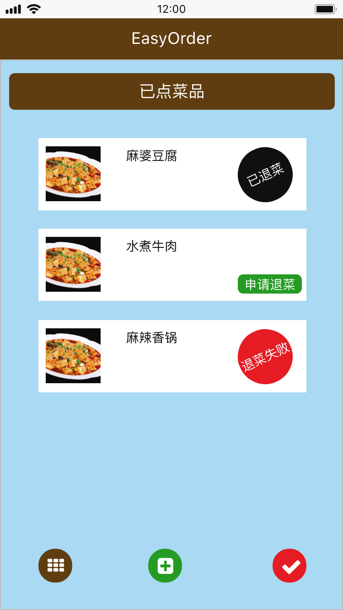

## 用例图

详见 [Usecase Diagram](./Use_Case_Diagram.md)

## 用例文本

1. Brief Level

+ **扫码登陆：** 顾客使用手机微信扫描餐台上的二维码，以餐台号作为 id 登陆进入点餐页面即可进行点餐。
+ **查看餐馆特色：** 顾客点击餐馆详情，可以浏览餐馆详细信息以及各种特色与招牌菜系。
+ **查询推荐菜品：** 顾客点击推荐菜品，可以浏览店主推荐的各种菜品及其详细信息。
+ **搜索菜品：** 顾客可以按照地区、口味、食材等多种类别筛选想要的菜品；也可以通过搜索框直接按关键字搜索菜品。
+ **私人定制：** 顾客可以在每个菜品的定制区设置对已选菜品的做法、口味要求以及材料选择等等，当所选的菜品及其原料和做法拥有充足库存时，系统成功完成私人定制并告知用户；否则，若检测到库存不足等错误，系统将告知用户私人定制失败并说明原因。

2. Casual Level

+ **处理退菜：**

    *主成功场景：*
    顾客重新扫描餐台上的二维码进入当前餐台号的点餐页面，点击页面底部“功能菜单”中“已下单的菜品”，选择要退点的菜品，点击“申请退菜”，点餐系统收到退菜要求，马上通知厨房以及餐馆经理，如果符合相关条件，则取消相应菜品的制作，并把钱返还给顾客；点餐系统更新订单信息，相应菜品的订单显示为“已退菜”。

    *交替场景：*
    + 如果厨房告知顾客选择要退的菜品已经上菜或在制作过程中，则不允许顾客退菜并告知退菜失败的原因。
    + 如果退款至顾客账户失败，则提醒用户更换退款账户，重新发起退菜申请或申请现金退款。
    + 如果系统检测到与餐馆记账系统通信失败，则告知用户发生位置错误，请求用户稍后发起退票，将该错误发送给管理员。

    *活动图：*

    

    *UI原型：*

    

3. Detailed Level

    详见 [详细用例建模](./用例建模.md)
